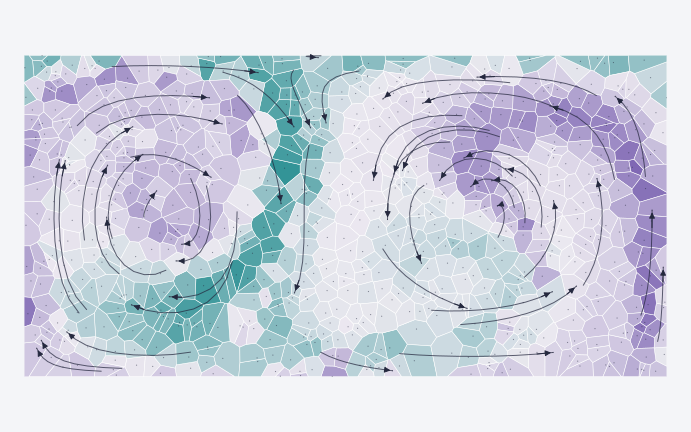

# Voronoi coherent structures



A Python companion to the Voronoi-based coherent-structure work of Martins and Rival. It integrates a double-gyre example, counts persistent Voronoi neighbours and computes a continuous spectral colour for each trajectory.

## Quick start

Python 3.10 or newer:

```bash
git clone https://github.com/EngFlavioMartins/voronoi-coherent-structures.git
cd voronoi-coherent-structures
python -m venv .venv
source .venv/bin/activate
python -m pip install -e .
voronoi-coherence
```

On Windows, activate with `.venv\Scripts\activate`. No notebook, GPU or external dataset is needed. The default demo uses 400 particles and 81 uniform frames.

Open `outputs/demo/coherence.png` or its SVG version. The command also saves raw trajectories, neighbour counts, spectral colours and a JSON diagnostic report.

## Examples

The denser header illustration is generated with:

```bash
voronoi-coherence --side 28 --frames 101 --duration 20 --seed 7 --output outputs/dense
```

For a quicker example:

```bash
voronoi-coherence --side 10 --frames 31 --duration 5 --output outputs/small
```

To analyse your own complete 2D tracks:

```python
import numpy as np
np.savez_compressed("tracks.npz", tracks=tracks, times=times)
# tracks: (frames, particles, 2), fixed particle identities
# times:  (frames,), increasing and uniformly spaced
```

```bash
voronoi-coherence --input tracks.npz --output outputs/measured
```

The Python `analyse(tracks, times)` API also supports 3D tracks. The CLI figures are two-dimensional.

## Method and scope

The diagnostic uses shared Voronoi edges, accumulated neighbour counts and the largest eigenvector of a normalised dissimilarity-graph Laplacian. Similar colours indicate similar positions in that spectral representation; no cluster count is imposed.

This is a **new implementation**, not the original experimental code or a reproduction of the paper's bluff-body dataset. The analytic double gyre is a kinematic benchmark, not a Navier–Stokes simulation.

Read [the method notes](docs/method.md) for equations, sampling assumptions and implementation decisions.

## Repository guide

| Location | Purpose |
| --- | --- |
| `src/voronoi_coherence/core.py` | Flow integration, neighbours and spectral analysis |
| `src/voronoi_coherence/plotting.py` | Clipped cells, trajectory plots and SVG headers |
| `src/voronoi_coherence/cli.py` | Reproducible command-line examples |
| `tests/` | Flow, geometry, invariance and eigenpair checks |
| `docs/assets/` | Generated vector artwork and diagnostic figures |

## Validation

```bash
python -m pip install -e ".[dev]"
python -m pytest -q
```

Checks cover no-through-flow boundaries, numerical divergence, integration convergence, rigid-frame invariance, a known two-group spectral case, Voronoi coverage, 3D input and invalid data. See [validation notes](docs/validation.md).

## Reference and licence

[Martins & Rival (2021), A Voronoi-tessellation-based approach for detection of coherent structures in sparsely-seeded flows](https://arxiv.org/abs/2103.09884).

The newly written code and generated artwork are under the [MIT licence](LICENSE). The linked paper retains its own licence. [Contributions](CONTRIBUTING.md) are welcome.

Plotting uses bundled IBM Plex Sans fonts under their separate [SIL Open Font Licence](src/voronoi_coherence/fonts/OFL.txt). No system font installation is required.
